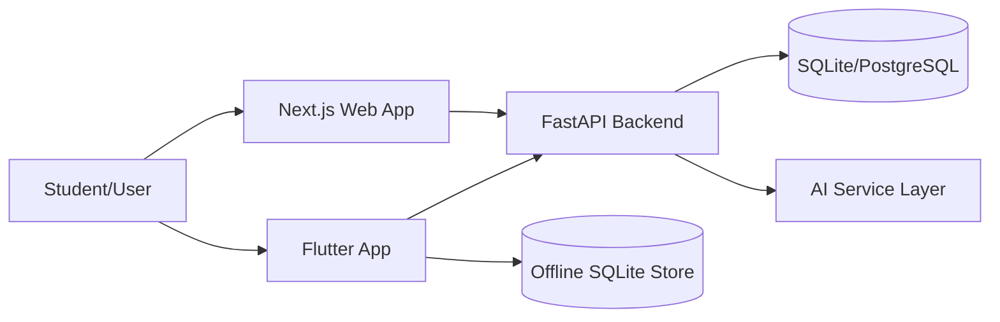

# SmartShiksha: A Multi-Platform AI-Enhanced Hybrid Learning System for Personalized K-12 Education

**Authors:** [Author Name(s)]  
**Affiliation:** [Institution / Organization]  
**Email:** [contact@example.com]

## Abstract
SmartShiksha is a hybrid educational platform that integrates a web application (Next.js), a cross-platform app client (Flutter), and a FastAPI backend to deliver curriculum-aware learning, AI tutoring, assessment workflows, and offline continuity. The system is designed for practical school environments with unstable connectivity, diverse board/curriculum requirements, and mixed device ecosystems. This paper presents the architecture, implementation, reliability improvements, and performance observations from iterative validation. Key contributions include: curriculum-specific content filtering, per-lesson offline downloads, AI-tutor session lifecycle support, robust token compatibility between external identity providers and local authorization, and content sanitization for malformed JSON-like AI payloads. Functional and performance tests show stable behavior across core user paths including Subjects, Mock Tests, AI Tutor, and Topic content pages.

**Keywords:** AI in Education, Hybrid Learning, Offline-First, FastAPI, Flutter, Next.js, Personalized Learning

---

## I. Introduction
Many EdTech systems fail in real deployment contexts due to intermittent internet, inconsistent identity systems, and mixed curriculum metadata. SmartShiksha addresses these gaps through a modular architecture focused on reliability, accessibility, and cross-platform parity.

The project goals are:
1. Support seamless learning across web and app clients.
2. Provide AI-assisted tutor interactions with persistent session management.
3. Ensure curriculum-aware filtering (class + board).
4. Preserve usability under low/no connectivity through offline content.
5. Normalize and render AI-generated content reliably.

---

## II. System Overview
### A. High-Level Architecture (Figure 1)

**Figure 1.** SmartShiksha multi-platform architecture.

### B. Core Modules
1. Authentication and user onboarding.
2. Subjects, chapters, topics, and question delivery.
3. AI Tutor sessions (create/list/read/delete).
4. Mock tests and exam generation.
5. Progress analytics and dashboard.
6. Community and textbooks.
7. Offline download and retrieval.

---

## III. Implementation Details
### A. Frontend (Next.js)
1. App Router pages for dashboard, subjects, topics, mock tests, AI tutor, etc.
2. API integration via Axios wrappers.
3. Clerk-based identity integration with backend auth compatibility path.
4. Topic content sanitization to remove malformed bracketed JSON wrappers.

### B. App Client (Flutter)
1. Unified API service layer with defensive ID normalization.
2. Curriculum filtering and subject/test de-duplication in UI.
3. Per-subject and per-lesson offline download support.
4. AI tutor session list with deletion support.

### C. Backend (FastAPI)
1. Router-based modular APIs (`auth`, `subjects`, `mock_tests`, `ai_tutor`, etc.).
2. Token resolution fallback for external JWT payload compatibility.
3. Topic/examples/practice fallback generation when data is sparse.
4. Session-based AI tutor workflows with message persistence.

---

## IV. Images and UI Evidence
### A. Subjects and Curriculum Filtering (Figure 2)
- Distinct class and board/curriculum filtering to prevent mixed subject display.

### B. Exam Generator Subject Selection (Figure 3)
- Subject de-duplication to avoid repeated chips.

### C. Topic Rendering Cleanup (Figure 4)
- Removal of visible JSON wrappers such as `{ "explanation": ... }`.

> Add project screenshots under `docs/images/` and reference them as below:
>
> ``
>
> ``
>
> ``

---

## V. Performance Evaluation
### A. Test Setup
1. Backend served on `127.0.0.1:8000`.
2. Frontend served via Next.js dev/build.
3. Flutter tested on Windows desktop target.
4. API and UI validation through end-to-end scenario checks.

### B. Observed Metrics
| Metric | Observed Value |
|---|---:|
| Subjects API records | 99 |
| Mock tests API records | 39 |
| Topic practice fallback question count (sample) | 3 |
| Flutter static analysis | No issues found |
| Flutter analyze runtime (observed range) | ~8s to ~22s |
| Next.js production build compile time (observed) | ~16.7s to ~18.9s |
| Next.js static page generation | 17/17 routes generated |

### C. Reliability Outcomes
1. 401 auth failures mitigated through token compatibility resolution.
2. String/int runtime cast crashes reduced via defensive normalization.
3. Empty examples/practice states mitigated via content and question fallback paths.
4. AI Tutor session operations verified (list/read/delete).

---

## VI. Discussion
SmartShiksha demonstrates that real-world educational reliability requires more than model integration. Production stability depends on robust auth bridging, content sanitation, fallback data strategies, and platform-consistent filtering behavior. The project’s engineering trajectory emphasized incremental hardening based on observed runtime failures rather than only static design assumptions.

---

## VII. Conclusion
SmartShiksha is a deployable hybrid learning system combining web + app clients, a modular backend, and AI-driven academic assistance. The platform addresses practical deployment constraints through offline support, resilient data rendering, curriculum-aware filtering, and robust session/auth handling. Future work includes large-scale learner studies, adaptive recommendation pipelines, and expanded multilingual pedagogical quality evaluation.

---

## References
[1] FastAPI Documentation. https://fastapi.tiangolo.com  
[2] Next.js Documentation. https://nextjs.org/docs  
[3] Flutter Documentation. https://docs.flutter.dev  
[4] SQLAlchemy Documentation. https://docs.sqlalchemy.org  
[5] OWASP Top 10. https://owasp.org/www-project-top-ten/
